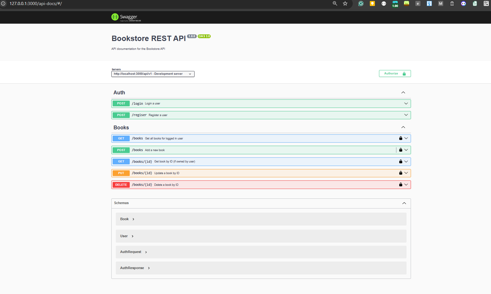

# BookStore API 

## Swagger Screenshot



## Set Up Instructions

```bash
git clone https://github.com/Sudip200/bookstore.git
```
```

cd bookstore
cd bookstore-api
add .env file (optional) default values are taken from config


JWT_SECRET 
JWT_EXPIRES_IN 
SALT_ROUND 
PORT 

npm install

npm run dev (for nodemon)

npm run build (for building the application)

npm start (after that)


```

## For Testing

After set-up and running the application open 

http://localhost:3000/api-docs/ for testing and api documentation
